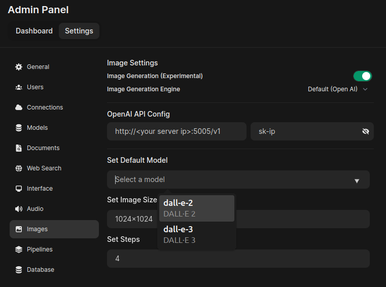
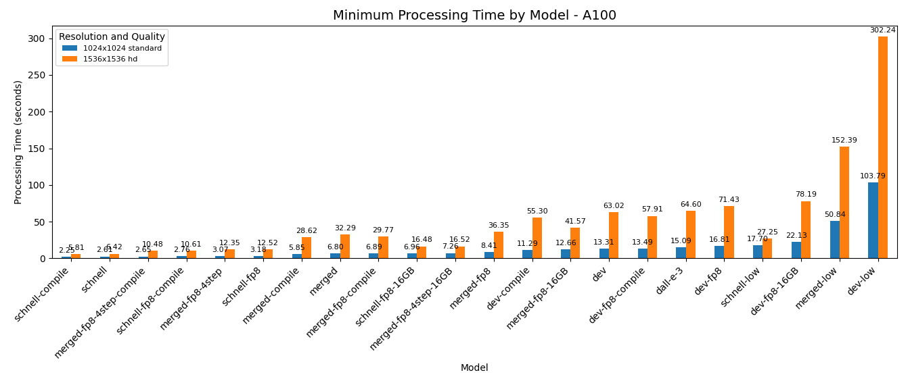
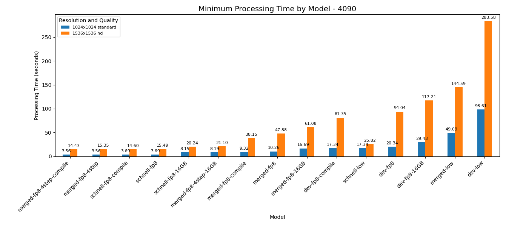

# OpenedAI Images Flux


## Overview

An OpenAI API compatible image generation server for the FLUX.1 family of models from [Black Forest Labs](https://huggingface.co/black-forest-labs)

> Not affiliated with OpenAI in any way, and no OpenAI API key is required.

## Features

- **Open Source**: The entire project is open source, allowing for transparency and customization
- **Compatibility**: Use it with [Open WebUI](https://openwebui.com/), or any other OpenAI API compatible images (dall-e) client
- **Custom Models**: Ready to use support for custom models, merges and quantizations (qfloat8 only so far)
- **Flexible**: Configurable settings for different models and enhancements
- **Enhancements**: Supports flexible AI prompt enhancers
- **Standalone Image Generation**: Uses your Nvidia GPU for image generation, doesn't use ComfyUI, SwarmUI or any other backend
- **Lora Support**: Support for multiple loras with individual scaling weights (strength)
- **Torch Compile Support**: Faster image generations with `torch.compile` (up to 20% faster in my tests, maybe more or less for other setups).
- **PNG Metadata**: Save images with generation parameters.
- [ ] **BNB NF4 Quantization** (planned)
- [ ] **Fast Quant Loading** (planned)
- [ ] **Upscaler Support** (planned)
- [ ] **GGUF Loading** (planned)
- [ ] **Easy to setup and use**: Maybe?


## Recent Updates

#### 2024-09-25
- fuse_qkv_projections option, fix for empty prompts

#### 2024-09-18
- fixup Docker config/lib path, thanks [@nicolaschan](https://github.com/nicolaschan)

<details>
<summary>Click to expand for older updates.</summary>

#### 2024-09-05
- Initial release

</details>

## Quickstart

> This is brand new software, if you find any problems or have suggestions please open a [new issue](https://githib.com/matatonic/openedai-images-flux/issues) on GitHub!

> The original BF16 black-forest-labs/FLUX.1 models are gated, you must request access, and you must set a HuggingFace token to access them.

### 1. Configure your environment:

Start by copying the `sample.env` file to `images.env`:
```shell
$ cp sample.env images.env
```

Edit `images.env` to set your API keys and any other environment settings you want, such as your huggingface token.
```
# Optional, but required for prompt enhancement, can be a local OpenAI API compatible server
OPENAI_BASE_URL=<http your openai chat server>:<port>/v1
OPENAI_API_KEY=sk-ip
# required for access to gated models
HF_TOKEN=XXXXXXX
```

Start with a copy of a default configuration that suits your environment:

```shell
# The original models, Full BF16 format, for 40GB+ GPU
cp config.default.json config/config.json
# or for 24GB GPU
cp config.default-24GB.json config/config.json
# or for 16GB GPU
cp config.default-16GB.json config/config.json
# or less
cp config.default-low.json config/config.json
```

The defaults are intended to provide good quality for `dall-e-2` and `dall-e-3` out of the box with no further configuration.  See [Model Configuration](CONFIG.md) for details.

### 2. Installation

Choose an installation option.

#### A. Docker (**recommended**, tested):
```shell
$ docker compose up -d
```

> Linux: Make sure your docker runtime supports the nvidia container toolkit

> Windows: Make sure docker is setup to use WSL2 and up-to-date Nvidia drivers are installed

#### B. Manual Install
```shell
# create an use a virtual env (venv) - optional
python3 -m venv .venv
source .venv/bin/activate
pip install -r requirements.txt
python images.py
```

### 3. Usage

Most API usage is identical to OpenAI's API, but you can also use any OpenAI API compatible client.

For example, it's simple to use with Open WebUI. Here is a screenshot of the config:

`Open WebUI > Admin Panel > Settings > Images > OpenAI API Config`



## API Guides & Documentation (from OpenAI)

- OpenAI Images Guide: (https://platform.openai.com/docs/guides/moderation)
- OpenAI Images API Reference: (https://platform.openai.com/docs/api-reference/moderations)

### API Compatibility
- [x] generations
- - [x] prompt
- - [x] model (whatever you configure, `dall-e-2` by default)
- - [x] size (anything that works with flux, `1024x1024` by default)
- - [X] quality (whatever you want, `standard` by default)
- - [x] response_format (`b64_json` preferred, `url` will use `data:` uri's)
- - [x] n
- - [ ] style (`vivid` by default) (currently ignored)
- - [ ] user (ignored)
- [ ] edits
- [ ] variations

## Python Client

You can use the OpenAI python client to interact with the API. A sample application, `generate.py` is included.

```shell
pip install -U openai
python generate.py -m dall-e-3 -s "1024x256" -f new_logo.png "A banner style logo for the website of the OpenedAI Images Flux, an OpenAI API Image generator server which uses the Black Forest Labs FLUX.1 model."
# Or simply:
python generate.py "An astronaut in the jungle"
```

See the OpenAI Images Guide API and API Documentation for more ways to use the API.

## Configuration

This server is designed to work out of the box with no extra configuration, but it's easy to tinker with.

There is a more detailed configuration guide in the [CONFIG.md](CONFIG.md).

## Pre-Configured models

Additional models are also available by default, there are option for all type of GPU setups.

* Only one model can be loaded at a time, and models are loaded on demand.

By default, the following models are configured (require ~40GB VRAM, bfloat16):

- `schnell`: `flux.1-schnell.json` FLUX.1 Schnell (official) (4 step)
- `dev`: FLUX.1 Dev (without enhancement) (25/50 steps)
- `merged`: `sayakpaul-flux.1-merged.json` Dev+Schnell merged, (12 steps)
- `dall-e-2` is set to use `shnell`
- `dall-e-3` is set to use `dev`, with prompt enhancement if an openai chat API is available.

Additional FP8 quantized models (require 24GB VRAM and can be slow to load, `+enable_vae_slicing`, `+enable_vae_tiling`):

- `schnell-fp8`: `kijai-flux.1-schnell-fp8.json` Scnhell with FP8 quantization (4 steps)
- `merged-fp8-4step`: `drbaph-flux.1-merged-fp8-4step.json` Dev+Schnell merged, FP8 quantization (4 steps)
- `merged-fp8`: `drbaph-flux.1-merged-fp8.json` Dev+Schnell merged, FP8 quantization (12 steps)
- `dev-fp8`: `kijai-flux.1-dev-fp8.json` Dev with FP8 quantization (25/50 steps)

Additional FP8 models (require 16GB VRAM and can be slow to load, `+enable_model_cpu_offload`):

- `schnell-fp8-16GB`: `kijai-flux.1-schnell-fp8-16GB.json` Scnhell (4 steps)
- `dev-fp8-16GB`: `kijai-flux.1-dev-fp8-16GB.json` Dev with FP8 quantization (25/50 steps)
- `merged-fp8-4step-16GB`: `drbaph-flux.1-merged-fp8-4step-16GB.json` Dev+Schnell merged (4 steps)
- `merged-fp8-16GB`: `drbaph-flux.1-merged-fp8-16GB.json` Dev+Schnell merged (12 steps)

Additional NF4 models (require 12GB VRAM):

- sayakpaul-dev-nf4-12GB: soon ...
- sayakpaul-dev-nf4-compile-12GB: soon ...

Low VRAM options (<4GB VRAM, 34GB RAM, `+enable_sequential_cpu_offload`, float16 instead of bfloat16):

- `schnell-low`: `flux.1-schnell-low.json` Schnell FP16 (4 steps)
- `merged-low`: `sayakpaul-flux.1-merged-low.json` Dev+Schnell FP16 merged (12 steps)
- `dev-low`: `flux.1-dev-low.json` Dev FP16 (25/50 steps)

There are `-compile` variants of many models as well. Be advised that the first couple images in a compiled model will be very slow to generate. The server must load, perhaps quantize and compile, and then the generation is dynamically optimized over the next couple generations, the first image may be 10 minutes or more to prepare. Most models can generate dozens of images in that time, so only use compiled models if you know what you're doing.

And more, including `int8` quants, check out the `config/lib` folder for more examples, including lora options such as ByteDance `hyper-flux-8steps-lora`.

> Timings are casually measured at 1024x1024 standard on an Nvidia A100 and may vary wildly from your system.

> \*) The name of the generator file is used to determine if a model is already loaded or not, if you edit a generator config in a way which requires reloading the model (such as changing `pipeline` or `options`), it wont reload it automatically. `config.json` and `generation_kwargs` will always be loaded each API call.

> Requesting an image generation with a special model called `unload` will unload the current model, freeing up it's RAM and VRAM resources.

## Performance

Performance plots for A100 (80GB) and 4090 (24GB), batch size = 1. Click Details to expand.

<details>
<summary> Performance details for A100 & 4090</summary>



*) `dall-e-3` in this plot is `FLUX.1 Dev, enhanced`, not OpenAI `dall-e-3`



</details>


## Server Usage

```pre
usage: images.py [-h] [-C CONFIG] [-S SEED] [-L {DEBUG,INFO,WARNING,ERROR,CRITICAL}] [-P PORT] [-H HOST]

OpenedAI Images Flux API Server

options:
  -h, --help            show this help message and exit
  -C CONFIG, --config CONFIG
                        Path to the config.json config file (default: config/config.json)
  -S SEED, --seed SEED  The random seed to set for all generations. (default is random) (default: None)
  -L {DEBUG,INFO,WARNING,ERROR,CRITICAL}, --log-level {DEBUG,INFO,WARNING,ERROR,CRITICAL}
                        Set the log level (default: INFO)
  -P PORT, --port PORT  Server tcp port (default: 5005)
  -H HOST, --host HOST  Host to listen on, Ex. 0.0.0.0 (default: 0.0.0.0)
```


# Troubleshooting and FAQ

#### "The following part of your input was truncated because CLIP can only handle sequences up to 77 tokens:"

* Long prompt encoding into CLIP is not yet supported (not working), all is not lost however, there are 2 encoders and the T5 encoder (text_encoder_2) supports up to 256 tokens. No fix yet.

#### "that cleft chin woman", "everyone is too beautiful"

* that's how the model works, try a lora

#### There are no protections for simultaneous users or requests

* concurrent requests may behave the unexpected ways

# Additional Links and References

[Black Forest Labs](https://blackforestlabs.ai/)
- [FLUX.1 Announcement Blog Post](https://blackforestlabs.ai/announcing-black-forest-labs/)
- [Black Forest Labs on Huggingface](https://huggingface.co/black-forest-labs)
- [FLUX.1-schnell](https://huggingface.co/black-forest-labs/FLUX.1-schnell)
- [FLUX.1-dev](https://huggingface.co/black-forest-labs/FLUX.1-dev)

Additional Model formats and merges created by:

- [@drbaph](https://huggingface.co/drbaph/), [@Kijai](https://huggingface.co/Kijai/), [@sayakpaul](https://huggingface.co/sayakpaul/)

# License Information

- OpenedAI Images FLux is released under the [GNU Affero General Public License v3.0](https://choosealicense.com/licenses/agpl-3.0/)
- [FLUX.1 \[dev\] Non-Commercial License.](https://huggingface.co/black-forest-labs/FLUX.1-dev/blob/main/LICENSE.md)
- [FLUX.1 \[schnell\] is Released under the apache-2.0 licence, the model can be used for personal, scientific, and commercial purposes.](https://choosealicense.com/licenses/apache-2.0/)


